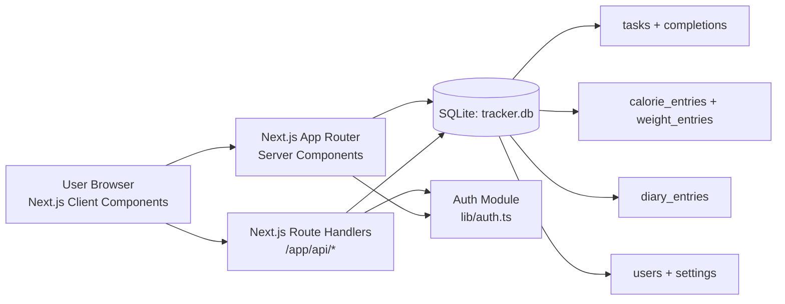
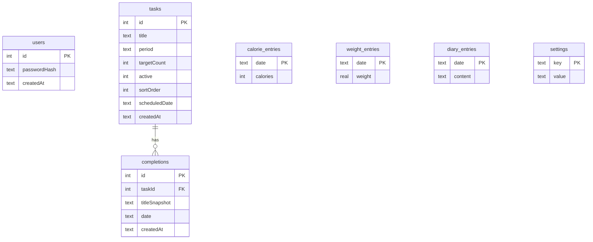

# System Architecture — Local-Only Productivity Web App

This document defines the architecture for the current local-only productivity platform built with Next.js + Tailwind + SQLite.

## 1) Architecture Goals

- **Local-first**: app runs entirely on `localhost` with no cloud dependencies.
- **Single-user**: one account model, optimized for personal laptop usage.
- **Fast UX**: minimal server round-trips, low-latency local SQLite access.
- **Simple operations**: install + run with `npm install` and `npm run dev`.
- **Extensible**: clear module boundaries for tasks, calories/weight, diary, and settings.

---

## 2) High-Level Architecture

### Core Layers

1. **Presentation Layer**
   - Next.js pages and reusable React components.
   - Tailwind-based responsive UI with sidebar + content layout.

2. **Application Layer**
   - Server-rendered page loaders (`app/*/page.tsx`) aggregate data for each view.
   - Route handlers (`app/api/*/route.ts`) mutate state.
   - Business rules: recurring tasks, one-time tasks, completion counting, weekly calorie analysis.

3. **Data Layer**
   - SQLite file (`tracker.db`) via `better-sqlite3`.
   - Schema evolution handled during app startup (`lib/db.ts`).

---

## 3) Module Breakdown

## A. Authentication (Local Single User)

- **Setup flow**: if no user exists, app redirects to `/auth/setup`.
- **Login flow**: password checked with bcrypt hash.
- **Session**: signed cookie (`tt_session`) using HMAC SHA-256.
- **Guards**: protected pages call `requireAuth()`.

**Primary files**
- `lib/auth.ts`
- `app/auth/setup/page.tsx`, `app/auth/login/page.tsx`
- `app/api/auth/setup/route.ts`, `app/api/auth/login/route.ts`, `app/api/auth/logout/route.ts`

## B. Tasks & Habits

### Task types
- **Recurring task**
  - `period = day|week`
  - has `targetCount`
- **One-time task**
  - stored in `tasks` with `scheduledDate`
  - appears only on that exact date (e.g., today/tomorrow)

### Completion model
- Completions stored in `completions` table per date key.
- Daily tasks use selected date; weekly tasks use week-start key.

### Reordering
- Drag-and-drop in client updates visual order.
- Persisted via `sortOrder` in `tasks` using `PUT /api/tasks`.

**Primary files**
- `app/tasks/page.tsx`
- `components/tasks-client.tsx`
- `app/api/tasks/route.ts`
- `app/api/completions/route.ts`

## C. Dashboard

- Computes today completion percent for daily tasks.
- Shows weekly trend as line graph.
- Shows today’s tasks in custom user-defined order.

**Primary files**
- `app/dashboard/page.tsx`
- `components/charts.tsx`

## D. Calories + Weight

- Date-keyed manual entries.
- Line charts for calorie and weight trends.
- Weekly summary:
  - `targetCalories * 7`
  - compare against last 7 calorie entries
  - display deficit/surplus and motivational message

**Primary files**
- `app/calories/page.tsx`
- `components/calories-client.tsx`
- `app/api/calories/route.ts`
- `app/api/weight/route.ts`

## E. Diary

- Date-based entry storage and editing.
- Distraction-free editor UI.

**Primary files**
- `app/diary/page.tsx`
- `components/diary-client.tsx`
- `app/api/diary/route.ts`

## F. Settings

- `targetCalories` managed in settings table.

**Primary files**
- `app/settings/page.tsx`
- `components/settings-client.tsx`
- `app/api/settings/route.ts`

---

## 4) Data Architecture

### Data decisions
- **Date keys (`yyyy-MM-dd`)** are used heavily for simple querying.
- **Weekly aggregation** uses Monday-start week key.
- **One-time tasks** reuse `tasks` table (`scheduledDate`) instead of separate temporary table.
- **Migration strategy**: startup-time additive columns (`sortOrder`, `scheduledDate`) preserve old local DBs.

---

## 5) Request/Interaction Architecture

## Read path (example: Tasks page)
1. User loads `/tasks?date=YYYY-MM-DD`.
2. Server page fetches tasks filtered by date (`scheduledDate IS NULL OR scheduledDate = selectedDate`).
3. Server fetches completion counts and returns hydrated model to client.
4. Client renders reorderable task list.

## Write path (example: reorder)
1. User drags task card.
2. Client updates local state and submits ordered IDs to `PUT /api/tasks`.
3. API updates `sortOrder` transactionally in SQLite.
4. Next page load preserves order.

## Write path (example: one-time tomorrow task)
1. User selects “One-time task” + “Add task for tomorrow”.
2. Client posts to `POST /api/tasks` with `mode=one-time` and `scheduledDate=tomorrow`.
3. Task appears only on tomorrow date view.

---

## 6) Security Architecture (Local Scope)

- Passwords stored as bcrypt hashes, never plaintext.
- Session cookie is `httpOnly` and HMAC-signed.
- Protected APIs and pages validate authentication.
- No external APIs/services used; all data remains local.

---

## 7) Runtime/Deployment Model

- **Runtime**: local Node.js process (`next dev` / `next start`).
- **Persistence**: local `tracker.db` file in project directory.
- **Network scope**: localhost usage intended.
- **No cloud infrastructure required**.

---

## 8) Suggested Future Extensions (Optional)

- Add soft-delete archive for tasks and restore UI.
- Add export/import (JSON) for local backups.
- Add stronger session expiration/rotation.
- Add optional offline PWA mode.
- Add automated tests for API route behavior and date logic.
