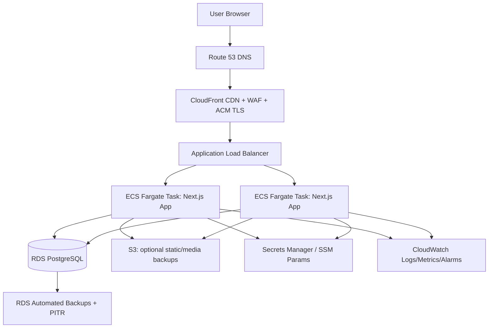
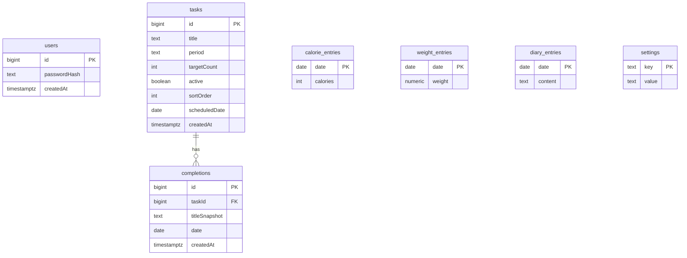

# System Architecture — AWS Cloud Deployment (Production)

This document defines the **cloud architecture on AWS** for deploying this productivity app publicly (not localhost), while preserving current product behavior.

> Current codebase is local-first and uses SQLite + in-process Next.js runtime. Cloud deployment requires infrastructure and persistence changes for reliability and scale.

---

## 1) Architecture Objectives

- Host app securely over HTTPS on the public internet.
- Keep UX fast globally with edge caching and compressed assets.
- Replace local `tracker.db` file with managed cloud database.
- Make app resilient across restarts/deployments and AZ failures.
- Use managed AWS services for security, secrets, observability, and backups.
- Keep architecture simple enough for small personal use, but production-ready.

---

## 2) High-Level AWS Architecture

---

## 3) Network & Security Boundary Design

### VPC Layout
- **VPC across 2+ Availability Zones**.
- **Public subnets**:
  - ALB only.
- **Private app subnets**:
  - ECS Fargate tasks.
- **Private data subnets**:
  - RDS PostgreSQL.

### Security Groups
- ALB SG: allow inbound `443` from internet; forward only to ECS SG.
- ECS SG: allow inbound only from ALB SG; outbound to RDS + AWS APIs.
- RDS SG: allow inbound only from ECS SG on DB port.

### TLS / Edge Security
- Use **ACM certificate** at CloudFront (and optionally ALB origin TLS).
- Attach **AWS WAF** (managed rules + rate limits) at CloudFront.
- Enable security headers (HSTS, X-Content-Type-Options, etc.) in Next.js or CloudFront response policies.

---

## 4) Application Runtime Architecture

### Compute
- Containerize app with Docker.
- Deploy as **ECS Fargate service** (minimum 1 task, recommended 2 for HA).
- ALB target group health checks route only to healthy tasks.

### Scaling
- Start with fixed small capacity for personal usage.
- Add autoscaling based on:
  - CPU/Memory.
  - ALB request count per target.

### Deployment Strategy
- CI/CD pipeline (GitHub Actions or CodePipeline) builds image and pushes to ECR.
- ECS rolling deployments with health checks.
- Optional blue/green deployments via CodeDeploy for zero-downtime safer releases.

---

## 5) Data Architecture in Cloud

## Database choice
- Replace SQLite with **RDS PostgreSQL** (or Aurora PostgreSQL).
- Keep same logical entities:
  - `users`
  - `tasks`
  - `completions`
  - `calorie_entries`
  - `weight_entries`
  - `diary_entries`
  - `settings`

## Data Reliability
- Automated daily backups.
- Point-in-time recovery enabled.
- Multi-AZ standby for production resilience.
- Periodic snapshot retention for rollback windows.

## Migration Strategy
- Use migration tooling (Prisma Migrate, Drizzle Kit, or Flyway).
- One-time export from SQLite to PostgreSQL.
- Validate row counts + key indexes after migration.

---

## 6) Auth & Session Architecture (Cloud)

Current app auth logic (bcrypt + signed cookie) can remain, but cloud hardening is required:

- Use strong `SESSION_SECRET` from **Secrets Manager/SSM**.
- Set cookie flags for internet deployment:
  - `httpOnly: true`
  - `secure: true` (HTTPS only)
  - `sameSite: 'lax'` or `strict`
- Rotate session secret with controlled deployment window.
- Optional future enhancement: store server-side session records in Redis/DB for revocation.

---

## 7) Caching & Performance Strategy

### CloudFront
- Cache static assets (`/_next/static/*`) aggressively.
- Short/controlled caching for dynamic HTML and authenticated responses.

### Next.js behavior
- Keep authenticated user pages dynamic/no-store.
- Use server components for data shaping close to DB.
- Optimize bundle size and chart rendering only where needed.

### Database performance
- Add indexes on common filters and joins (examples):
  - `tasks(sortOrder, active, scheduledDate)`
  - `completions(taskId, date)`
  - `calorie_entries(date)` / `weight_entries(date)` / `diary_entries(date)`

---

## 8) Observability & Operations

### Logging
- Send app stdout/stderr to CloudWatch Logs.
- Structured JSON logs preferred for queryability.

### Metrics
- ALB metrics: latency, 4xx/5xx, target response time.
- ECS metrics: CPU, memory, task health.
- RDS metrics: connections, CPU, storage, slow queries.

### Alerts
- CloudWatch alarms to SNS/Email for:
  - ALB 5xx spikes.
  - ECS task crash loops.
  - RDS storage nearing threshold.
  - elevated response latency.

### Runbooks
- Incident runbooks for DB failover, rollback, and secret rotation.

---

## 9) Cost-Aware Reference Tiers

## Personal/Low Traffic (cheapest stable)
- 1 ECS task, small Fargate size.
- 1 RDS instance (single-AZ, automated backup).
- CloudFront + ALB.

## Production/High Availability
- 2+ ECS tasks across AZs.
- Multi-AZ RDS.
- WAF, stronger alarms, automated rollback pipeline.

---

## 10) End-to-End Request Flow (Cloud)

1. User hits domain in browser.
2. Route 53 resolves to CloudFront.
3. CloudFront terminates TLS with ACM cert.
4. WAF filters malicious traffic.
5. CloudFront forwards dynamic requests to ALB.
6. ALB routes to healthy ECS Fargate task.
7. Next.js page/API executes business logic.
8. App reads/writes PostgreSQL in RDS.
9. Response returns via ALB → CloudFront → Browser.
10. Logs/metrics emitted to CloudWatch; alarms evaluated.

---

## 11) Required Code-Level Changes for AWS Move

- Replace `better-sqlite3` with PostgreSQL-compatible access layer.
- Introduce `DATABASE_URL` and secret retrieval from AWS-managed secret store.
- Update cookie config for production HTTPS (`secure: true`).
- Add containerization (`Dockerfile`) and runtime config.
- Add health endpoint for ALB checks.
- Add startup migration step in deployment workflow.

---

## 12) Optional Fully-Managed Alternative

If you want minimal ops effort and can tolerate managed constraints:
- Host Next.js on **AWS Amplify**.
- Use **RDS/Aurora PostgreSQL** for data.
- Use Secrets Manager + CloudWatch + WAF similarly.

This reduces infrastructure management compared with ECS, but ECS gives finer runtime control.
